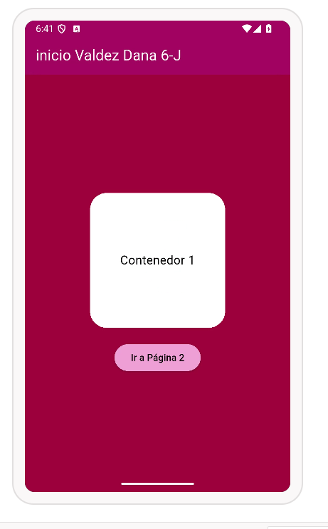
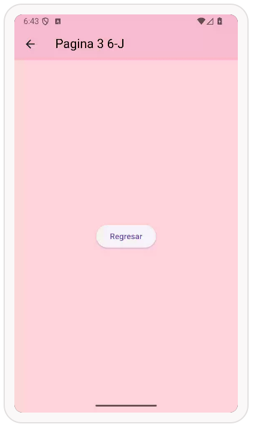
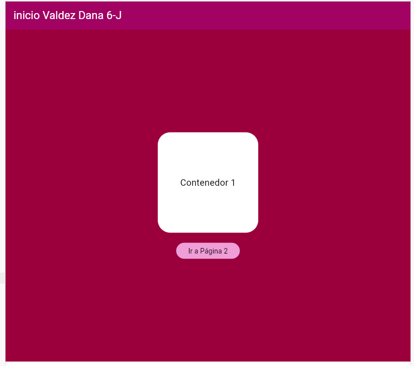
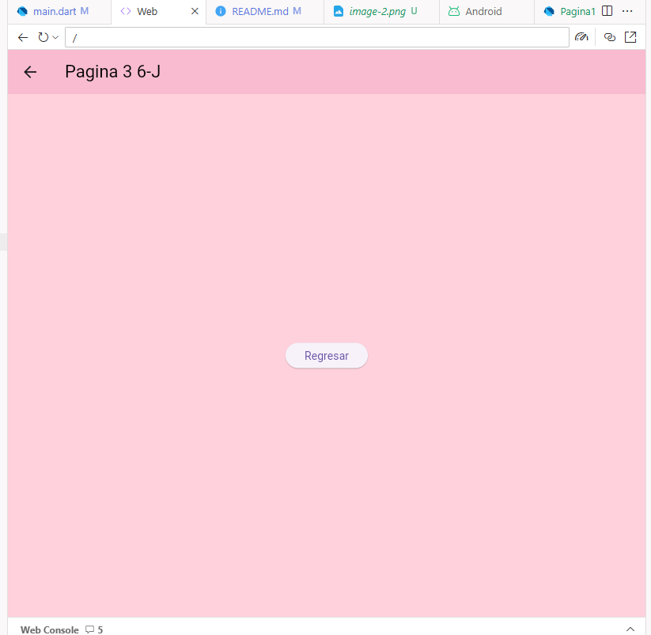

# Navegacion entre paginas en Flutter
# Valdez Perez Dana 6-J
# Mi promt o preguntas a la IA
A new Flutter project.

# lenguaje dart flutter, nivel principiante, navegación entre 3 paginas utilizando rutas nombradas, desde main llamar a la pagina 1, en la pagina 1 en app bar mostrar el texto "inicio Valdez Dana 6-J" en color azul claro, color de fondo azul rey, iconos blancos, en body un contenedor redondeado color blanco, 200 por 200, con texto negro y centrado, y un botón de color amarillo  claro, texto negro para avanzar a pagina 2, en la pagina 2 un app bar con texto "Segunda pagina 6-J" en rojo, fondo negro e iconos blancos, en body una imagen desde la red , y un botón para avanzar a la pagina 3, en la pagina 3 en App bar un texto color negro "Pagina 3 6-J", color de fondo rosa claro, todo en un solo archivo 

For help getting started with Flutter development, view the
[online documentation](https://docs.flutter.dev/), which offers tutorials,
samples, guidance on mobile development, and a full API reference.
## Pantallas en Android 
## Pantallas en la Web 

